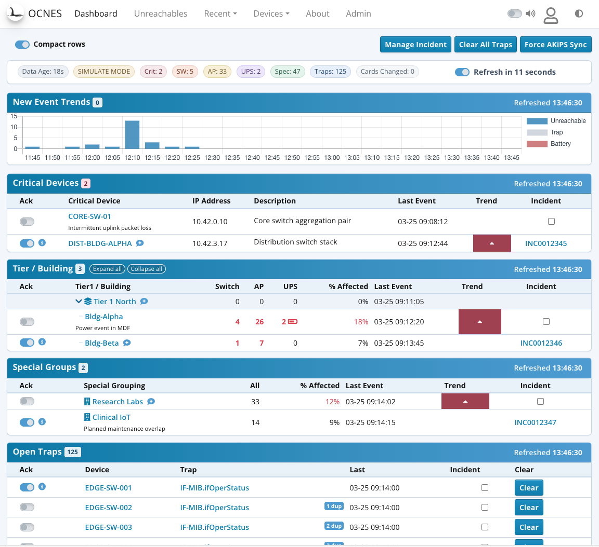

# OCNES

Operations Center Network Event Summary (OCNES) provides a dashboard view of network health. It is built on top of the [AKiPS Network Monitoring Software](http://akips.com) network monitoring platform, which provides all polling and status data.



## Why?

The AKiPS platform is a powerful tool on its own.  OCNES was developed using the AKiPS API to provide a view summarized for network and device topologies.

## Install

Setup is needed inside AKiPS.  Refer to [Setup Readme](akips_setup/README.md).

## Running

This project was initially designed to run under OpenShift.

It also runs under Docker, refer to [Docker Readme](Docker.md).

Most recently work has been to build a K3s setup..

## API Usage

OCNES supports programmatic access to selected read-only API endpoints.

Interactive users still authenticate through the normal web login flow, which is typically backed by LDAP in production. For service integrations, staff users can now create scoped API keys from the Settings page and limit each key to specific endpoints.

### Create an API Key

1. Sign in as a staff user.
2. Open the Settings page.
3. In the `API Access Keys` section, create a key and select the allowed endpoint scopes.
4. Copy the generated key when it is shown. The full secret is only displayed once.

New keys default to selecting all currently available read-only API paths:

- `/api/devices/`
- `/api/unreachables/`
- `/api/summaries/`

### Supported Authentication Headers

The current read-only exports accept either of these headers:

- `X-API-Key: YOUR_NEW_KEY_HERE`
- `Authorization: Api-Key YOUR_NEW_KEY_HERE`

### Available Endpoints

- `/api/devices/`
- `/api/unreachables/`
- `/api/summaries/`

### Devices API

Endpoint:

- `/api/devices/`

Returns device inventory records plus the last inventory sync and AKIPS sync timestamps.

Example request using `X-API-Key`:

```bash
curl \
	-H "X-API-Key: YOUR_NEW_KEY_HERE" \
	"https://your-dashboard-host/api/devices/"
```

Example request with pretty-printed JSON:

```bash
curl \
	-H "X-API-Key: YOUR_NEW_KEY_HERE" \
	"https://your-dashboard-host/api/devices/?pretty_print=1"
```

### Unreachables API

Endpoint:

- `/api/unreachables/`

Returns currently open unreachable records.

Example request using `X-API-Key`:

```bash
curl \
	-H "X-API-Key: YOUR_NEW_KEY_HERE" \
	"https://your-dashboard-host/api/unreachables/"
```

Example request with pretty-printed JSON:

```bash
curl \
	-H "X-API-Key: YOUR_NEW_KEY_HERE" \
	"https://your-dashboard-host/api/unreachables/?pretty_print=1"
```

### Summaries API

Endpoint:

- `/api/summaries/`

Returns current summary records and supports existing filtering parameters such as `type` and `status`.

Example request using `X-API-Key`:

```bash
curl \
	-H "X-API-Key: YOUR_NEW_KEY_HERE" \
	"https://your-dashboard-host/api/summaries/"
```

Example request with pretty-printed JSON:

```bash
curl \
	-H "X-API-Key: YOUR_NEW_KEY_HERE" \
	"https://your-dashboard-host/api/summaries/?pretty_print=1"
```

Example request filtered to open critical summaries:

```bash
curl \
	-H "X-API-Key: YOUR_NEW_KEY_HERE" \
	"https://your-dashboard-host/api/summaries/?type=Critical&status=Open&pretty_print=1"
```

Example request using the `Authorization` header instead:

```bash
curl \
	-H "Authorization: Api-Key YOUR_NEW_KEY_HERE" \
	"https://your-dashboard-host/api/summaries/"
```

### Notes

- API keys only work for endpoints explicitly allowed when the key is created.
- Requests to endpoints outside that allowlist return `403 Forbidden`.
- Missing or invalid keys return `401 Unauthorized`.
- The same authentication header formats work for `/api/devices/`, `/api/unreachables/`, and `/api/summaries/`.
- Existing session-based browser access continues to work unchanged.

## Dashboard and HUD Mode

OCNES has two primary viewing modes:

- Dashboard mode: the standard interactive operations view.
- HUD mode: a wall-display oriented view for operations center monitors.

### Dashboard Mode

Open the main dashboard at the app root:

- /

You can also enable HUD styling from the dashboard route with query parameters:

- /?hud=1

### HUD Mode

Open the dedicated HUD route:

- /hud/

HUD mode is optimized for large displays and can be tuned with URL query options.

### HUD Query Options

- scale: controls HUD text scaling.
	- Default on /hud/: 1.9
	- Allowed range: 1.0 to 1.9
	- Example: /hud/?scale=1.9
- simulate: enables simulated card data for testing and demo workflows.
	- Use simulate=1 to enable simulation mode.
	- Effective only for staff users.
	- In simulate mode, acknowledgement and clear actions are disabled.
	- Example: /hud/?simulate=1

You can combine options:

- /hud/?scale=1.9&simulate=1

## Contributing

Contributions are welcome.  The project has been in-house for a while but we recently published the repository to facilitate collaboration with other higher education institutions utilizing AKiPS.  

[CONTRIBUTING.md](https://github.com/unc-network/dashboard/blob/develop/CONTRIBUTING.md)

---
UNC Chapel Hill
ITS Networking
https://github.com/unc-network
https://sc.its.unc.edu/network (campus only)
