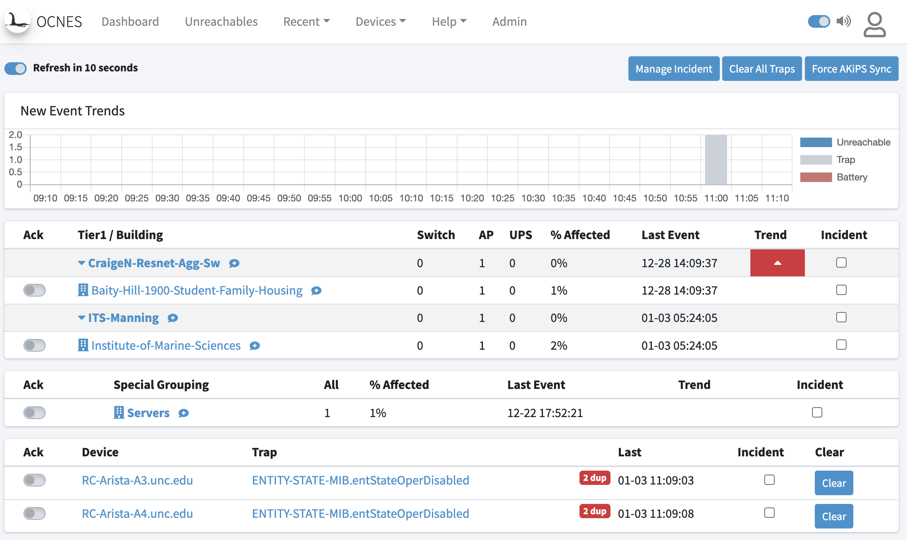

# OCNES

Operations Center Network Event Summary (OCNES) provides a dashboard view of network health. It is built on top of the [AKiPS Network Monitoring Software](http://akips.com) network monitoring platform, which provides all polling and status data.

## Why?

The AKiPS platform is a powerful tool on its own.  OCNES was developed using the AKiPS API to provide a view summarized for network and device topologies.

## Install

Setup is needed inside AKiPS.  Refer to [Setup Readme](akips_setup/README.md).

## Running

This project was initially designed to run under OpenShift.

It also runs under Docker, refer to [Docker Readme](Docker.md).

Most recently work has been to build a K3s setup..

## Contributing

Contributions are welcome.  The project has been in-house for a while but we recently published the repository to facilitate collaboration with other higher education institutions utilizing AKiPS.  

[CONTRIBUTING.md](https://github.com/unc-network/dashboard/blob/develop/CONTRIBUTING.md)

---
UNC Chapel Hill
ITS Networking
https://github.com/unc-network
https://sc.its.unc.edu/network (campus only)
