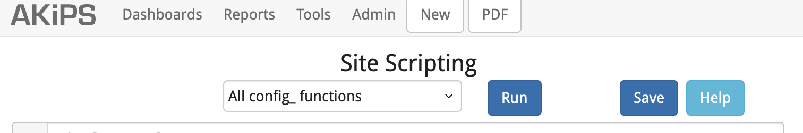

AKIPS Setup
===

AKIPS is the engine that drives OCNES, so setup is required for them to interoperate.

## Device Grouping

Use **Auto Grouping** rules to organize the network hierarchy.  This gives AKiPS and 
OCNES some topographical knowledge to facilitate grouping of alerts.

Menu: Admin -> Grouping -> Auto Grouping

### Critical Devices

Critical devices are organized into groups with the "1-" name prefix.

```
add device group 1-DC-Franklin 
add device group 1-DC-Manning

assign * * sys SNMPv2-MIB.sysLocation value /^DCF-|^Datacenter-/ = 1-DC-Franklin
assign * * sys SNMPv2-MIB.sysLocation value /^DCM-|^Datacenter-/ = 1-DC-Manning
```

### Distribution Tiers

High level distribution tiers are organized into groups with the "2-" name prefix.

An additional level is organized under the "3-" name prefix for building entrance switches
but OCNES does not consume that data since the are bundled in the building groups.

```
add device group 2-Campus-Services 
add device group 2-Business-School 

assign * * sys SNMPv2-MIB.sysLocation value /^CSvc-/ = 2-Campus-Services 
assign * * sys SNMPv2-MIB.sysLocation value /^SoB-/ = 2-Business-School 
```

### Building Networks

Buildings level access are organized into groups with the "4-" name prefix.

```
add device group 4-Abernethy-Hall
add device group 4-Ackland-Art-Museum

assign * * sys SNMPv2-MIB.sysName value /-002-/ = 4-Abernethy-Hall
assign * * sys SNMPv2-MIB.sysName value /-003-/ = 4-Ackland-Art-Museum
```

### Special Grouping

Allow for things like servers or standalone devices with the "5-" name prefix.

```
add device group 5-Servers

assign * * sys SNMPv2-MIB.sysDescr value "/VMware ESXi/" = 5-Servers
```

## AKIPS API Accounts

API access to AKIPS works through either a read-only user account and a read-write user account.
You will need to follow the documenation and enabled the local accounts via **User Settings**.
For purposes of OCNES, the api-rw account is needed since some functions require extra access.

1. api-ro
2. api-rw

## Site Scripts

Menu: Admin -> API -> Site Scripting



Copy paste the contents of the [akips_site_scripting.pl](site_scripting.pl) file into the site script.

You will need to set two values based on your enviornment.
1. hostname of your OCNES instance
2. token value to use with POST.

## Status Alert

Menu: Admin -> Alerting -> Status Alerts

```
# OCNES Alerts
* * ping4 PING.icmpState = call custom_post_status_to_dashboard
* * sys SNMP.snmpState = call custom_post_status_to_dashboard
wait 5m * * ups UPS-MIB.upsOutputSource = call custom_post_status_to_dashboard
* * battery LIEBERT-GP-POWER-MIB.lgpPwrBatteryTestResult = call custom_post_status_to_dashboard
```

## Trap Alert

Menu: Admin -> Alerting -> Trap Alerts

```
# Send all alerts to dashboard
/.*/ = call custom_post_trap_to_dashboard
```