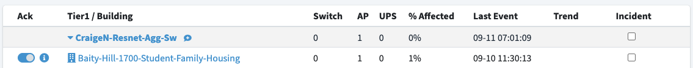

AKIPS Setup
===

AKIPS is the engine that drives OCNES, so setup is required for them to interoperate.
To create effective alert summaries, logical groupings are applied to stratify both 
a device's place in the network hierarchy but also its device type.



## Network Hierarchy Grouping

Use **Auto Grouping** device rules to organize the network hierarchy.  This gives AKiPS and 
OCNES some topographical knowledge to facilitate grouping of alerts.

Menu: Admin -> Grouping -> Auto Grouping

### Critical Devices

Critical devices are organized into groups with the "1-" name prefix.

```
add device group 1-DC-Franklin 
add device group 1-DC-Manning

assign * * sys SNMPv2-MIB.sysLocation value /^DCF-|^Datacenter-/ = 1-DC-Franklin
assign * * sys SNMPv2-MIB.sysLocation value /^DCM-|^Datacenter-/ = 1-DC-Manning
```

### Distribution Tiers

High level distribution tiers are organized into groups with the "2-" name prefix.

An additional level is organized under the "3-" name prefix for building entrance switches
but OCNES does not consume that data since the are bundled in the building groups.

```
add device group 2-Campus-Services 
add device group 2-Business-School 

assign * * sys SNMPv2-MIB.sysLocation value /^CSvc-/ = 2-Campus-Services 
assign * * sys SNMPv2-MIB.sysLocation value /^SoB-/ = 2-Business-School 
```

### Building Networks

Buildings level access are organized into groups with the "4-" name prefix.

```
add device group 4-Abernethy-Hall
add device group 4-Ackland-Art-Museum

assign * * sys SNMPv2-MIB.sysName value /-002-/ = 4-Abernethy-Hall
assign * * sys SNMPv2-MIB.sysName value /-003-/ = 4-Ackland-Art-Museum
```

### Special Grouping

Allow for things like servers or standalone devices with the "5-" name prefix.

```
add device group 5-Servers

assign * * sys SNMPv2-MIB.sysDescr value "/VMware ESXi/" = 5-Servers
```

## Device Type Grouping

OCNES also groups devices by the type.  This is used in the device counts of the dashboards.

* SWITCH
* AP
* UPS

Two methods are used to determine device type.  The first is based on parsing the SysName 
field from AKiPS and the second is a supplement inventory json feed.

### SysName Convention

OCNES organizes devices around three main device types.  This is primarily accomplished by
the device naming convention.

* "-tier1", "-bes", "-sw", "-spine", "-pod" are all associated with switches
* "-ap" will flag 
* "-ups" will flag 

### Auxiliary Inventory Feed

OCNES can pull inventory data from an external feed to supplement device 
classifications.  The environment variables define the feed location and
an authorization token.

    INVENTORY_URL=https://device_inventory.unc.edu/json/full_dump.json
    INVENTORY_TOKEN=ijq@HahZ3iT%^-IneZnuI&3aq@5KI6$!

The JSON data below is obtained from a GET call.  The device type is applied 
based on the **type** field.

```
{
    "errors": [],
    "links": [],
    "nodes": [
        {
            "ip": "172.29.8.16",
            "type": "switch",
            "building_name": "Physician Off",
            "hierarchy": "EDGE",
            "building_id": "658",
            "sysobjectid": ".1.3.6.1.4.1.1916.2.258",
            "sysdescr": "ExtremeXOS (X460G2-24p-24hp) version 30.7.3.12 30.7.3.12 by release-manager on Fri Feb 11 07:21:30 EST 2022",
            "id": "172.29.8.16",
            "inventory_url": "https://nit.net.unc.edu/search_switches.pl?ip=172.29.8.16&submit=submit",
            "syslocation": "Mars-658-PhysicianOff-SW5-RmG169"
        },
        {
            "building_id": "643",
            "sysdescr": "CrNR-643-RamsVil560PH-AP_1106",
            "inventory_url": "https://nit.net.unc.edu/search_aps.pl?ip=172.29.72.55&submit=submit",
            "syslocation": "RamsVil 560 PH",
            "id": "172.29.72.55",
            "ip": "172.29.72.55",
            "type": "ap",
            "building_name": "RamsVil 560 PH"
        },
        {
            "type": "ap",
            "building_name": "RamsVil 560 PH",
            "ip": "172.29.72.61",
            "sysdescr": "CrNR-643-RamsVil560PH-AP_11H",
            "syslocation": "RamsVil 560 PH",
            "inventory_url": "https://nit.net.unc.edu/search_aps.pl?ip=172.29.72.61&submit=submit",
            "id": "172.29.72.61",
            "building_id": "643"
        },
    ]
}
```

## AKIPS API Accounts

API access to AKIPS works through either a read-only user account and a read-write user account.
You will need to follow the documentation and enabled the local accounts via **User Settings**.
For purposes of OCNES, the api-rw account is needed since some functions require extra access.

    AKIPS_SERVER=akips_server.example.com
    AKIPS_USERNAME=api-rw
    AKIPS_PASSWORD={api-rw-pwd}

## Site Scripts

AKiPS supports custom api scripts that can be saved through the **Site Scripting** web page. OCNES
uses methods to push data from AKiPS and other methods to interface with AKiPS data.

Menu: Admin -> API -> Site Scripting

Copy paste the contents of the [akips_site_scripting.pl](site_scripting.pl) file into the site script.

Inside the contents, you will need to set two values based on your OCNES deployment. Find these
two lines and set appropriately.

* my $OCNES_URL = "https://ocnes.example.com/webhook/";
* my $OCNES_TOKEN = "xxxxxxxxxxxxxxxxxxxxxxxxxxxxxxxxxxxxxxxx";

The token defined in the site script should be defined as environment variable in OCNES.

    AKIPS_WEBHOOK_TOKEN=xxxxxxxxxxxxxxxxxxxxxxxxxxxxxxxxxxxxxxxx

### Status Alert

OCNES primarily looks at the **ping** and **SNMP** up/down status from AKiPS.  When at least one
of those attributes shows "down" OCNES will update its dashboard accordingly.

OCNES also looks at two UPS attributes. The output source status gives insight when power issues
exists and also when battery tests fail. The wait time is needed on the output source to cut down
on false positives from temporary work or the periodic battery test.

Menu: Admin -> Alerting -> Status Alerts

```
# OCNES Alerts
* * ping4 PING.icmpState = call custom_post_status_to_dashboard
* * sys SNMP.snmpState = call custom_post_status_to_dashboard
wait 5m * * ups UPS-MIB.upsOutputSource = call custom_post_status_to_dashboard
* * battery LIEBERT-GP-POWER-MIB.lgpPwrBatteryTestResult = call custom_post_status_to_dashboard
```

### Trap Alert

OCNES will take in SNMP trap data for display on the dashboard.  With the variety of possible traps, 
we have found it most effective to filter out the traps we do not want to see while sending everything
else to OCNES.

Menu: Admin -> Alerting -> Trap Alerts

```
# Example mute to exclude from dashboard feed
/NET-SNMP-AGENT-MIB.nsNotifyRestart/ = mute

# Send all alerts to dashboard
/.*/ = call custom_post_trap_to_dashboard
```